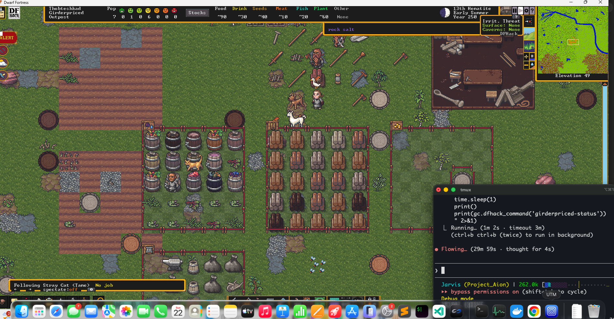
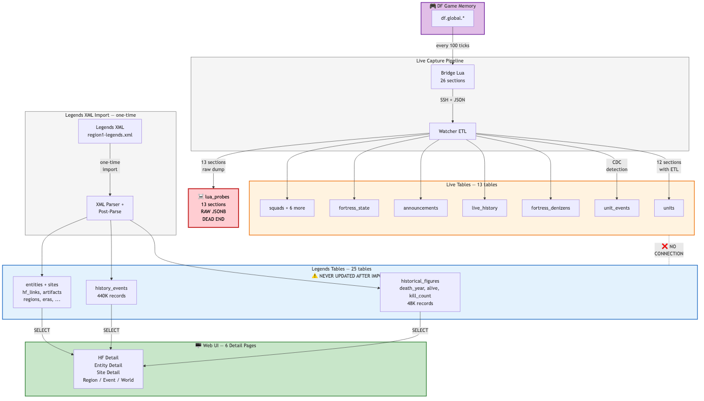
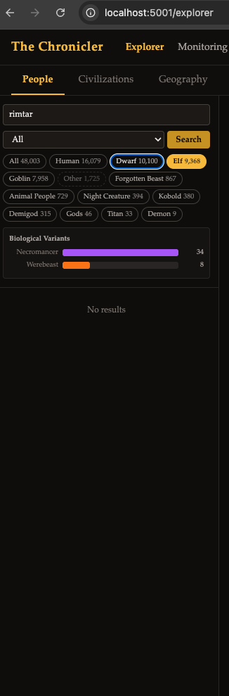

<p align="center">
  
  
  
  
  
</p>

# Chronicler

**An AI-powered living atlas for Dwarf Fortress.** Chronicler connects directly to a running game via DFHack, ingests live fortress state through Lua/Protobuf streaming, structures it into a 40+ table relational model, and uses LLMs to transform raw simulation data into browsable, cross-linked narrative histories.

The core technical challenge: Dwarf Fortress generates some of the richest emergent narrative data in any simulation, but it's locked inside opaque binary state and XML dumps with no relational structure. Chronicler solves this with a full ETL pipeline that maps live memory, legends exports, and real-time game events into a unified Common Data Model, then layers semantic search and narrative intelligence on top.



---

## Turning Simulated History Into Structured Knowledge

Dwarf Fortress worlds contain hundreds of thousands of interconnected events spanning centuries of simulated history: wars, migrations, artifact creation, political succession, and the daily lives of individual characters. The data engineering problem is substantial.

**Common Data Model**: 40+ PostgreSQL tables with composite primary keys for multi-world support, covering geography, civilizations, historical figures, artifacts, events, military structures, and fortress state. The schema evolved through 16 migrations as new data sources came online.

**Live State Capture**: A Lua bridge script runs inside DFHack on 100-tick intervals, serializing 17 data sections (units, emotions, skills, squads, buildings, diplomacy, incidents, event collections) to JSON. A polling daemon detects meaningful changes -- arrivals, deaths, skill progressions, mood shifts -- and logs structured events to PostgreSQL in real time.

**Narrative Scoring Engine**: Every historical event (473K+ in a typical world) receives a composite narrative weight:

```
narrative_weight = base_weight * character_importance * rarity_multiplier * irony_bonus
drama_score = base_drama * escalation_factor
```

The engine then detects story arcs (siege defense, golden age, succession crisis, rise and fall) by clustering temporally and thematically related events, and builds 28K+ causal links between them.

**Semantic Search**: Entity descriptions and narrative text are embedded using Qwen3 (2560-dim vectors) via pgvector, enabling natural-language queries across the generated corpus.

**Knowledge Horizon**: A visibility masking system that limits what the explorer and storyteller can surface to what the fortress would plausibly know -- expanding dynamically as caravans arrive, wars are declared, and migrants bring news.

---

## Architecture

| Layer | Components | Purpose |
|-------|-----------|---------|
| **Ingestion** | XML parser, DFHack RPC client, Lua bridge, Protobuf | Ingest legends exports and live game state |
| **ETL** | 14 expanded ETL functions, change detector, denizen registry | Transform raw data into CDM tables |
| **Storage** | PostgreSQL + pgvector, 16 SQL migrations | Relational model with vector similarity |
| **Narrative** | Scoring engine, causal linker, arc detector, LLM generators | Score, link, cluster, and narrate events |
| **Embedding** | Qwen3 2560-dim via MLX, content-hash deduplication | Semantic search across all entities |
| **Explorer** | FastAPI + Jinja2, 151 HTML templates, 15 route modules | Web UI with calendar, entity browser, live view |



The web explorer provides faceted search across 48K+ historical figures, filterable by race, biological variant, and civilization:



---

## Key Capabilities

| Feature | Detail |
|---------|--------|
| Multi-world support | Composite `(world_id, id)` keys across all tables |
| Live fortress monitoring | Polling daemon with configurable tick intervals |
| Narrative arc detection | 8 arc types: siege defense, golden age, megabeast attack, succession crisis, and more |
| Causal event linking | 5 link types: cascading death, invasion triggered, economic collapse, social cascade, military weakened |
| LLM story generation | Hybrid keyword + agentic mode using local models (Qwen3-8B/32B) |
| Knowledge Horizon | 3-phase visibility expansion with event-based revelation rules |
| Diff-mode ingestion | Merge new legends exports without destroying existing data |
| Semantic entity search | pgvector similarity queries across the full corpus |

---

<details>
<summary><strong>Prerequisites</strong></summary>

- Python 3.11+
- PostgreSQL 15+ with the `vector` and `unaccent` extensions
- A running Dwarf Fortress instance with [DFHack](https://docs.dfhack.org/)
- (Optional) MLX embedding server for semantic search
- (Optional) LiteLLM or compatible LLM endpoint for narrative generation

</details>

<details>
<summary><strong>Installation</strong></summary>

```bash
# Clone and install
git clone https://github.com/CannonCoPilot/DwarfCron.git
cd DwarfCron
python -m venv .venv
source .venv/bin/activate
pip install -e .

# Initialize database
chronicler init-db

# Ingest a legends export
chronicler ingest --legends path/to/region-legends.xml

# Launch the web explorer
chronicler serve --reload
```

The web UI will be available at `http://localhost:8080`.

</details>

<details>
<summary><strong>CLI Reference</strong></summary>

```bash
chronicler init-db                    # Create schema and run migrations
chronicler worlds list                # Show all worlds with entity counts
chronicler worlds delete --world-id N # Remove a world and all associated data
chronicler ingest --legends DIR       # Parse and import legends XML
chronicler ingest --update            # Diff-mode merge into existing world
chronicler serve --reload             # Launch web UI with hot reload
chronicler sync-live --world-id 1     # Pull live units from DFHack
chronicler watch                      # Start the polling daemon
chronicler embed --world-id 1         # Generate vector embeddings
chronicler narrate --world-id 1       # Run the narrative scoring pipeline
```

</details>

<details>
<summary><strong>Live Bridge Setup</strong></summary>

The DFHack bridge runs as a Lua script inside the game process, serializing fortress state to JSON on every 100-tick cycle:

```
# On the Dwarf Fortress machine (DFHack console):
repeat --name chronicler --time 100 --timeUnits ticks --command [ chronicler-bridge ]

# Start the HTTP server (PowerShell):
Start-Process -NoNewWindow python -ArgumentList "-m http.server 8888"
```

Configure the connection in environment variables or `chronicler/config.py`:

```bash
export DFHACK_HOST=192.168.64.3
export BRIDGE_PORT=8889
```

</details>

---

## Project Structure

```
chronicler/
  api/            # FastAPI app, 15 route modules, 151 templates
  db/             # Schema (1,350 lines), 16 migrations, connection pool
  dfhack/         # RPC client, Lua bridge reader, watcher daemon
    etl_expanded.py      # 14 ETL functions for live bridge data
    etl_state_capture.py # Fortress snapshot + report classification
    watcher.py           # Polling daemon with change detection
  embedding/      # Chunking, MLX client, batch/incremental pipelines
  explorer/       # Calendar view, perspective engine, death classification
  ingest/         # XML parser, post-parse enrichment, validation
  storyteller/    # Narrative scoring, causal linking, arc detection, LLM generation
  kh.py           # Knowledge Horizon visibility engine
tests/            # 19 test modules covering schema, narrative, embedding, validation
```

---

## Technical Decisions

**Why PostgreSQL over a document store?** The relational model matters here. Historical events reference figures, sites, entities, and artifacts through dense foreign key networks. Causal links and narrative arcs are fundamentally relational queries. pgvector adds vector similarity without a second database.

**Why local LLMs?** Narrative generation runs against hundreds of thousands of events. Using local models (Qwen3 via LiteLLM) keeps per-world costs at zero while allowing rapid iteration on prompts and scoring weights.

**Why a Lua bridge instead of pure RPC?** DFHack's RPC `CoreSuspend` is broken in recent builds -- it hangs when called from the RPC server thread. The Lua bridge runs on the console thread where suspension works correctly, providing access to game state that RPC alone cannot reach.

---

> [!NOTE]
> Chronicler is under active development. Phases 1-3 (Data Foundation, Explorer Core, Live Integration) are complete. Phase 4 (Narrative Engine) is in progress.

---

<p align="center"><i>Chronicler -- turning emergent simulation into structured, searchable, narratable history.</i></p>